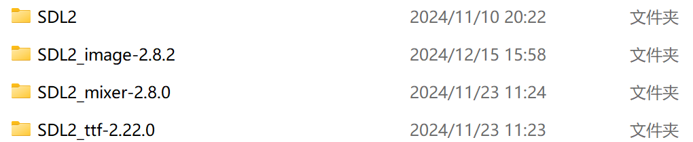

# SDL2-Shooter

参考视频：[【配环境如此简单】C 图形界面 SDL2 配置教程（2022新版）](https://www.bilibili.com/video/BV1w841157uD?buvid=XXAD8D3AB1B9C3957DAAA2249E3841EF8D04D&from_spmid=search.search-result.0.0&is_story_h5=false&mid=pg%2B4lFGzPCBzO1GKL%2BP9FA%3D%3D&plat_id=116&share_from=ugc&share_medium=android&share_plat=android&share_session_id=e1b51ee8-43ce-4a56-8d49-ef1b1b12e2cc&share_source=WEIXIN&share_tag=s_i&spmid=united.player-video-detail.0.0&timestamp=1734253230&unique_k=dkTxG47&up_id=12502995&vd_source=cf271c8579d72a79d485e31ffd6ca42d)

## 环境配置

> - Cmake
> - C++ mingw64 库
> - SDL2 (SDL2, SDL2_image, SDL2_mixer, SDL2_ttf)

本项目在 `Windows` 下，使用 `Clion` 构建运行

### 库整合包

[CUHKSZ-Onedrive](https://cuhko365-my.sharepoint.com/:f:/g/personal/123090343_link_cuhk_edu_cn/ErMti6-sLHpErHW8k6J5z0ABId7Ma0a2e2Ceq8NefFM70A?e=wdQrYv)


下载 `mingw64` 即可

### (or) 手动整合

#### 1. mingw64

在 [https://winlibs.com/](https://winlibs.com/) 下载最新的 `Win64` `Zip` 压缩包解压


#### 2. SDL2

在对应 Github Release 下载对应的 `SDL2_XXX-devel-X.XX.X-mingw.zip`


- [SDL2](https://github.com/libsdl-org/SDL/releases/latest) 
- [SDL2_image](https://github.com/libsdl-org/SDL_image/releases/latest) 
- [SDL2_ttf](https://github.com/libsdl-org/SDL_ttf/releases/latest) 
- [SDL2_mixer](https://github.com/libsdl-org/SDL_mixer/releases/latest) 

解压后我们得到如下文件：




每个 `SDL2` 文件夹目录下一定有如下文件：


打开 `x86_64-w64-mingw32`， 复制该目录下所有文件，粘贴到 `mingw64` 目录下


### 添加环境变量

将 `...\mingw64\bin` 添加到 `Windows` 环境变量 `Path` 内

### Clion设置

`文件->设置->构建、执行、部署->工具链`下选择对应的 `mingw64`

## CmakeList

在项目根目录下

```
cmake_minimum_required(VERSION 3.26)
project(untitled C CXX)

set(CMAKE_C_STANDARD 99)
set(CMAKE_CXX_STANDARD 20)

include_directories(include)
add_subdirectory(src)

target_link_libraries(untitled mingw32)
target_link_libraries(untitled SDL2main)
target_link_libraries(untitled SDL2)
target_link_libraries(untitled SDL2_image)
target_link_libraries(untitled SDL2_ttf)
```
正确环境配置即可正常运行

项目 `/src` 目录下

```
add_executable(untitled
        main.cpp
        background.cpp
        drop_items.cpp
        enemy.cpp
        Player.cpp
        bullet.cpp
        boss.cpp
        enemy_control.cpp
        minion_explosion.cpp
        minion_bullet.cpp
        boss_attack.cpp
)
```

若要添加类，添加对应的 `XXX.cpp` 文件即可